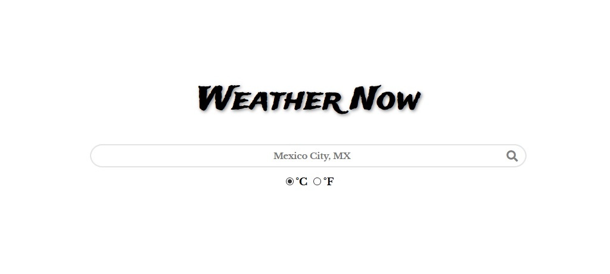

# WeatherNow

> This is a weather app built with HTML, CSS and JavaScript based on this [T.O.P. project](https://www.theodinproject.com/courses/javascript/lessons/weather-app). The main purpose is to work with APIs and asynchronous functions.

## Built With

- HTML,
- CSS (SCSS),
- JavaScript (Node)

## Live Demo

[Live Demo Link](https://matheus-fls.github.io/weather-app/dist/)

## Getting Started

To get a local copy up and running follow these simple example steps.

### Prerequisites
  A text editor of your choice and Internet connection.
  
### Setup
  Clone the repository on your local or cloud machine.
  
### Install
  Run `npm i` on your terminal to install the required dependencies;
  Then run `npm run server` to launch the local server. It will open on your main browser.
  
### Usage
  Type the name of your city (country optional) and select your preferred unit (°C/°F). Click on the search icon or press Enter.

## Author

**Matheus Silva**

- Github: [@matheus-fls](https://github.com/matheus-fls)
- Twitter: [@Matheus06600798](https://twitter.com/Matheus06600798)
- Linkedin: [Matheus F. Lopes da Silva](https://www.linkedin.com/in/matheus-f-lopes-da-silva-05610a107/)

## 🤝 Contributing

Contributions, issues and feature requests are welcome!

Feel free to check the [issues page](https://github.com/matheus-fls/weather-app/issues).

## Show your support

Give a ⭐️ if you like this project!

## Acknowledgments

- Lots of thanks to my Team, especially [Mauricio](https://github.com/MauricioRobayo) for the great feedback.

## 📝 License

This project is [MIT](lic.url) licensed.
